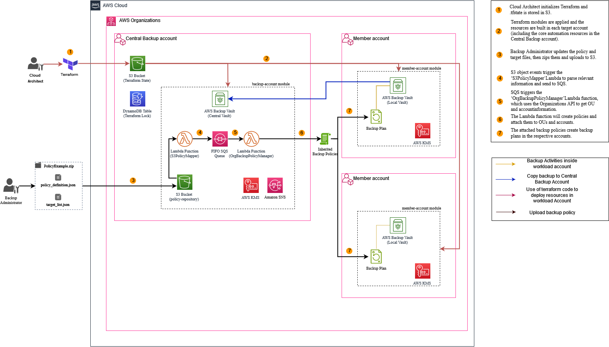

# AWS Backup with Terraform

This solution demonstrates how you can save time using Terraform to automate the deployment of your AWS Backup resources across accounts in your organization. Using this solution, you can centrally manage the deployment of AWS Backup resources, such as vaults, as well as backup policies, for all of your AWS Organizations accounts.

## Prerequisites

- [AWS Organizations](https://docs.aws.amazon.com/organizations/latest/userguide/orgs_getting-started.html) enabled and access to the _Management account_.
- [AWS Backup features enabled for your organization](https://docs.aws.amazon.com/organizations/latest/userguide/services-that-can-integrate-backup.html).
- An AWS account that will be used as your _Central Backup account_. This account should be [registered as a delegated administrator](https://aws.amazon.com/blogs/storage/delegated-administrator-support-for-aws-backup/) for AWS Organizations.
- [Terraform v1.3.6](https://developer.hashicorp.com/terraform/downloads) or later installed.

## Solution Overview



## Getting started

### Terraform init

1. To manage the Terraform state, Amazon S3 is used to store our `.tfstate` file and a Amazon DynamoDB table to maintain the _lock state_ of our environment. Create these resources and update the `backend.tf` file with the appropriate values. You can learn more about protecting sensitive data in the Terraform state file using [the AWS Prescriptive Guidance](https://docs.aws.amazon.com/prescriptive-guidance/latest/secure-sensitive-data-secrets-manager-terraform/terraform-state-file.html).

2. If you plan to use the _OrganizationAccountAccessRole_ for cross-acount operations, then you do not need to create any additional roles for managing these resources. However, you will need to update the trust relationships with the `Principal` of the IAM role or user you will be using to run the Terraform commands from the _Management account_.

As a best practice, you will want to create roles specifically for Terraform to assume in each account following least privilege. Update the `role_arn` within the `provider.tf` file with the roles you will use.

3. Run the `terraform init` command to initialize the working directory and install the plugin for the AWS provider.

### Deploy resources

1. Setup the Terraform variables required to deploy resources into the accounts. Create a `terraform.tfvars` file in the root module and populate them with the appropriate values.

The `target_account_id` is the account number of the _Member account_ which containers resources that you wish to backup. The `backup_account_id` is the account number of the _Central Backup account_. The `org_id` is the [Organization ID](https://docs.aws.amazon.com/organizations/latest/userguide/orgs_manage_org_details.html#orgs_view_org) which you can find from the AWS Organizations console in you _Management account_.

```
target_account_id = "012345678901"
backup_account_id = "234567890123"
org_id = "o-a12b3cdefg"
```

2. Run the `terraform apply` command to deploy resources within your member and backup account.

### Define backup policies

The _Central Backup account_ should be [registered as a delegated administrator](https://aws.amazon.com/blogs/storage/delegated-administrator-support-for-aws-backup/) from your organizations _Management account_ as part of the [prerequisites](#prerequisites). This will allow AWS Backup to assume cross-account roles and access the AWS Organizations API to manage backup policies.

The policy management process involves creating a `.zip` archive containing two JSON files, then uploading it to your designated S3 bucket, created during the [deploy resources](#deploy-resources) stage. These two files are: a backup policy, and a list of target OUs/accounts.

1. The `modules/backup-account/PolicyExample/policy_definition.json` is a backup policy that is formatted using the syntax described in the [AWS Backup documentation](https://docs.aws.amazon.com/organizations/latest/userguide/orgs_manage_policies_backup_syntax.htm). Review or adjust this file to your requirements.

2. The `modules/backup-account/PolicyExample/target_list.json` file contains a list of targets, which can be a combination of OU IDs and account IDs. In this example it will contain the single _Member account_ we have prepared earlier. Edit the file with the `target_account_id`.

```
{
    "targets":
    [
        "AccountID"
    ]
}
```

3. Archive these two files to a `.zip` and upload to your S3 bucket within the _Central Backup account. This will trigger two Lambda functions to unzip, parse, validate and apply the policy and attach it to the specified targets.

## Considerations

As mentioned in the [Getting Started](#getting-started) section, this sample uses the _OrganizationAccountAccessRole_ role which is created when an account is created in your organization. If you would like to follow along with the sample you will need to update the trust relationships of the role with the `Principal` of the IAM role or user you will be using to run the Terraform commands from the _Management account_. However, it is recommended to create a new role that is present within your accounts that Terraform can assume. If you have done so update the `role_arn` within the `provider.tf` file with the role arn.

This sample uses customer-managed keys (CMK) in AWS KMS, it is important that you configure these to your requirements. Key deletion windows and rotation can be set within the `variables.tf` file. It is also important [to monitor](https://docs.aws.amazon.com/kms/latest/developerguide/monitoring-overview.html) AWS KMS to control and understand the availability, state and usage of the CMKs.

AWS Backup supports cross-account backup copying within your AWS Organization for centralized backup management. For cross-account copies of encrypted backups, some AWS services have their own encryption and is not independent of AWS Backup encryption. For data sources without AWS Backup encryption, source and destination backup vault must be encrypted with a shared AWS KMS customer-managed key. For more information see the storage blog on [How encryption works in AWS Backup](https://aws.amazon.com/blogs/storage/how-encryption-works-in-aws-backup/).

## Security

See [CONTRIBUTING](CONTRIBUTING.md#security-issue-notifications) for more information.

## License

This library is licensed under the MIT-0 License. See the LICENSE file.

